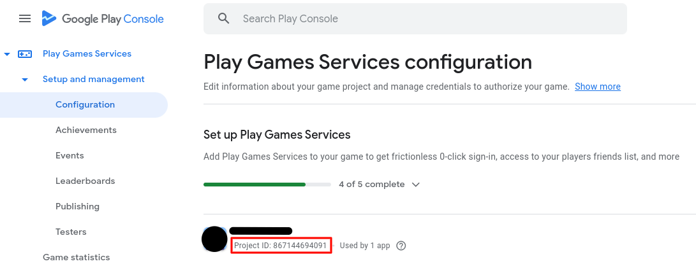
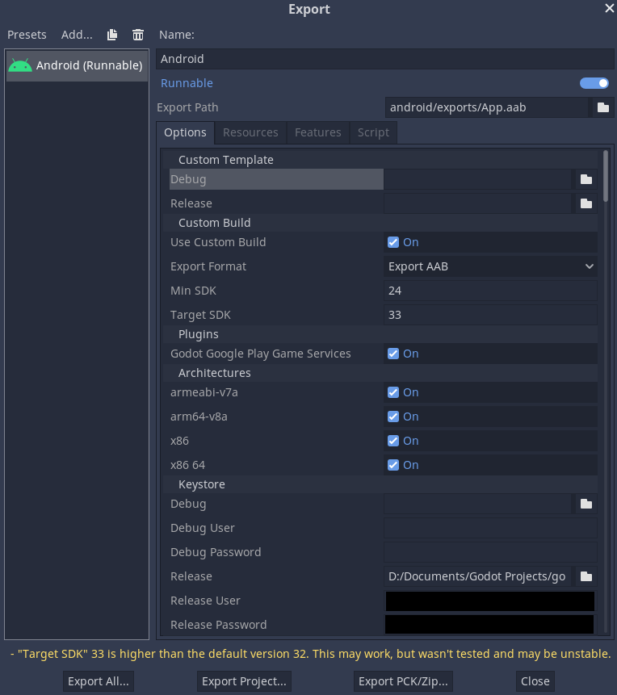

[](https://developer.android.com)
[](https://github.com/godotengine/godot/)
[](https://developers.google.com/games/services/android/quickstart)

> ⚠️ A **Godot 4.x** version of this plugin can be found [here](https://github.com/Iakobs/godot-play-game-services)!

> ⚠️ This plugin has a [GDScript plugin wrapper](https://github.com/Iakobs/godot-google-play-game-services-plugin) addon that provides a global singleton with **code completion** out-of-the-box, amongst other things. While not required, the Godot plugin will help you integrate this Android native plugin in your project (and it also comes with a demo project to showcase the features).

> ⚠️ In order to use the Google Play Game Services, you will need a Google Play Console developer account, which involves a **once in a lifetime payment of $25** at the time of writing (January 2024).

# Table of contents

- [Credits and Acknowledgments](#credits-and-acknowledgments)
- [Introduction](#introduction)
  - [Purpose](#purpose)
  - [Supported features](#supported-features)
- [Building](#building)
- [How to use](#how-to-use)
  - [Setup Google Play Console account and app](#setup-google-play-console-account-and-app)
  - [Configure your editor Android settings](#configure-your-editor-android-settings)
  - [Install and edit the Android build template](#install-and-edit-the-android-build-template)
  - [Paste the plugin to the corresponding folder](#paste-the-plugin-to-the-corresponding-folder)
  - [Create the Android run export configuration](#create-the-android-run-export-configuration)
- [GDScript Reference](#gdscript-reference)

# Credits and Acknowledgments

This plugin started as an update of [cgisca's plugin](https://github.com/cgisca/PGSGP).

[@rafalagoon](https://github.com/rafalagoon) suggested to update the plugin since it was not working with Godot versions 3.3.x or later, and Google has provided a complete revamp of the integration with their game services.

As the task to update cgisca's plugin involved learning how to use the new Google Play Game Services library, the android library as well, and a bunch of things completely new to me, I decided to start from scratch in this new repository.

# Introduction

## Purpose

This is an **Android plugin** for **Godot 3.x** to integrate the new revamp of [Google Play Game Services v2](https://developers.google.com/games/services) in your games.

Sadly, it is not an **exhaustive integration** because Google Play Game Services has many APIs and some of the DTOs being returned are not compatible with Godot or difficult to map from Java to GDScript.

That being said, we've tried to include as much as we thought it was necessary to provide a **professional integration** with Google's games system.

> ⚠️ This plugin is still a work in progress, so bear with us as we introduce more integrations!

## Supported features

The plugin is (*as far as it can be*) a **one to one mapping** of the APIs of Google Play Games Services, described [here](https://developers.google.com/android/reference/com/google/android/gms/games/package-summary).

So far, the plugin provides the following features:

- [Achievements](https://developers.google.com/android/reference/com/google/android/gms/games/AchievementsClient)
- [Events](https://developers.google.com/android/reference/com/google/android/gms/games/EventsClient)
- [Leaderboards](https://developers.google.com/android/reference/com/google/android/gms/games/LeaderboardsClient)
- [Players](https://developers.google.com/android/reference/com/google/android/gms/games/PlayersClient)
- [Sign In](https://developers.google.com/android/reference/com/google/android/gms/games/GamesSignInClient)
- [Snapshots](https://developers.google.com/android/reference/com/google/android/gms/games/SnapshotsClient)

# Building

> ⚠️ These steps apply for those who wish to build this native Android plugin from Java/Kotlin source code. If that's not your case, jump to [How to use](#how-to-use).

> ⚠️ The Godot's [official documentation](https://docs.godotengine.org/en/3.5/tutorials/platform/android/android_plugin.html) has details related to creating and building native plugins for Android.

In short follow these steps:

- Install the JDK (Java Development Kit)
  - Version 11 or later
- Download the Godot [AAR Library for Android](https://godotengine.org/download/3.x/).
  - Copy .aar file to the folder `godot-lib.release` and rename it to `godot-lib.release.aar`
- Compile the library
  - Open the command line window
  - `cd` into the root directory of this repository
  - Run the following command:
    - Windows:
      - `gradlew.bat assembleRelease`
    - Linux:
      - `./gradlew assembleRelease`
  - Copy the newly created `.aar` file to your plugin directory:
    - `app/build/outputs/aar/GodotPlayGamesServices.release.aar` to `[your Godot project]/android/plugins/`

# How to use

In order to use this plugin in your Godot game, you have to follow some steps. **It might seem tedious and daunting**, but we have tried to provide comprehensive instructions. The general steps summary is as follows:

- Create and setup your Google Play Console account and app
- Create a new Godot project
- Configure your editor Android settings
- Install and edit the Android build template for custom builds
- Paste the plugin `.aar` and `.gdap` files in the proper folder (`android/plugins`), available in the releases page of this repository
- Create the Android export configuration

Below there is an extensive guide on the steps shown above. Please, **read carefully** and review that you didn't miss any steps if you find any problems down the line. You can also reach out for help at my [Mastodon account](https://mastodont.cat/@iakobsdesamos).

## Setup Google Play Console account and app

- Create a Google Play Console dev account (this step involves a payment)
- Create a new app of type game
- Configure your achievements, leaderboards, etc.

## Configure your editor Android settings

> ⚠️ In-depth instructions about this topic can be found at Godot's [official documentation](https://docs.godotengine.org/en/3.5/tutorials/export/exporting_for_android.html).

First of all, you have to tell Godot where is your **Android SDK** and your **keystore** located. This assumes that you have an Android SDK installed on your computer, which is installed, for example, when you install [Android Studio](https://developer.android.com/studio/). We strongly recommend you to do so, as Android Studio is also used if you want to compile the plugin on your own or to collaborate with us!

For the keystore, you can [create one](https://docs.godotengine.org/en/3.5/tutorials/export/exporting_for_android.html#create-a-debug-keystore) or use the default `debug.keystore` that Android Studio creates when you run an android app for the first time, the only requirement is that the keystore `SHA1` code matches the one in your Google Cloud certificate. More info on this [here](https://developers.google.com/android/guides/client-auth).

We recommend you to create two sets of credentials in your Google Cloud: one one for testing with the `debug.keystore` and [another one](https://docs.godotengine.org/en/3.5/tutorials/export/exporting_for_android.html#exporting-for-google-play-store) for the release of your game with a keystore created by you with a secure and strong password. Then you can select the credentials at use in your android app in the Google Dev Console, in the Google Play Games Services section.

The place to put this information in your Godot editor is in `Editor` > `Editor Settings...` > `Export` > `Android`. The android SDK path goes into the `Android SDK Path` field at the bottom, while the keystore location, user and password go, respectively, in the `Debug Keystore`, `Debug Keystore User` and `Debug Keystore Pass` fields.


## Install and edit the Android build template

> ⚠️ In-depth instructions about this topic can be found at Godot's [official documentation](https://docs.godotengine.org/en/3.5/tutorials/export/android_custom_build.html).

First you need to get the export templates for your current Godot version. Just head to `Editor` > `Manage Export Templates...` to download and install them. This is default for any project, Android export or not.


Now, to use the Android plugin, you will need to install an **Android build template** to your project. This is done via the Godot editor. Just click `Project` > `Install Android Build Template...` and you will be able to install the template.

This template is basically an **Android Gradle project** that will be used as a template when exporting your game as an Android `apk` or `aab` file, and it will be installed in your `android/build` folder. There, you will find the `AndroidManifest.xml` file. Open it and add the following anywhere inside the `<application/>` tag:

```xml
<application ...>

  <!-- Google Play Game Services -->
  <meta-data android:name="com.google.android.gms.games.APP_ID"
      android:value="@string/game_services_project_id"/>

  ...

</application>
```

Then, create a file named `strings.xml` in the following path of your Godot project: `android/build/res/values` and copy this to the file. If the file already exists, you only need to copy the `<string... />` tag:

```xml
<?xml version="1.0" encoding="utf-8"?>
<resources>
    <string translatable="false" name="game_services_project_id">146910152586</string>
</resources>
```

You have to replace the project id with the id of your app in Google Play Console.



We also recommend you to **update the Gradle wrapper** to version 7.5 and the **Gradle plugin** to version 7.4.2, the latest at the time of writing (April 2023). To do so:

- **Update gradle wrapper:** Update the `android/build/gradle/wrapper/gradle-wrapper.properties` file, so the version you see there is `gradle-7.5-bin`
- **Update gradle plugin:** In the `android/build/config.gradle` file, change the `androidGradlePlugin` property (usually in line 2 of the file) to `7.4.2`

## Paste the plugin to the corresponding folder

In order to *install* the Android plugin, you just need to download the `.gdap` and `.aar` files from the [releases section of this repository](https://github.com/Iakobs/godot-google-play-game-services-android-plugin/releases) and put them in your godot project, under the `android/plugins` folder.

> ⚠️  This is a simple but **MANDATORY** step. This is actually how you install the plugin, so don't miss this step!

## Create the Android run export configuration

You have to create an export configuration to build the `aab` file of your game. As opposed to `apk` files, which is the old format, Google recommends using the new `aab` bundle format for your Android apps.

The export configuration can be found under `Project` > `Export...`. This opens a new window where you have to add a new Android configuration. Once you click on the `Add` button and select the Android option, the export configuration will appear. The changes that need to be done are:

* **Under the `Custom build` section:**
  * **Use Custom Build:** On
  * **Export Format:** Export AAB
  * **Min SDK:** 24 (this is the least minimum that we need to be able to use the Google library for game services, but can be higher, thus limiting the number of devices that can run your game)
  * **Target SDK:** The recommendation is to use the latest one. 33 at the time of writing (January 2024)
* **Under the `Plugins` section:**
  * Your plugins appear here once you have them under your `android/plugins` folder. In this case, you have to activate the plugin named `Godot Google Play Game Services`
* **Under the `Architectures` section:**
  * This section contains checkboxes for the main android supported architectures. Just check them all.
* **Under the `Keystore` section:**
  * This section is important, this is where you tell Godot where are your **keystores, user and passwords**, in order to sign the resulting `aab` file. As mentioned in the configuration of your game credentials in your Google Play Console account, the keystore that you use here shall have the same user and password (thus the same SHA1) as the one you will use in your credentials AND to sign the app. You usually only need to specify the release keystore information here.



# GDScript Reference

For a GDScript reference on how to interface this native plugin, see [here](REFERENCE.md).
