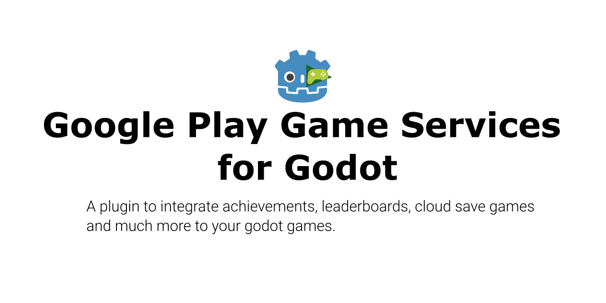
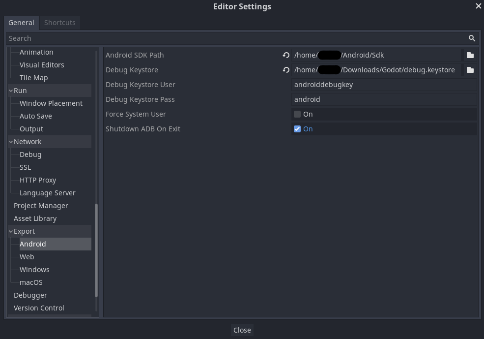
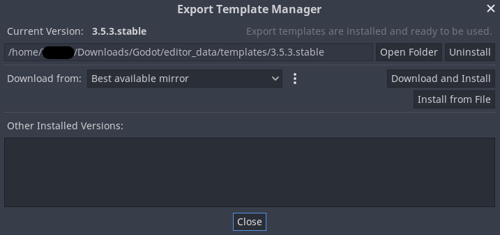

[](https://developer.android.com)
[](https://github.com/godotengine/godot/)
[](https://developers.google.com/games/services/android/quickstart)

> :warning: In order to use the Google Play Game Services, you will need a Google developer account, which involves a **once in a lifetime payment of $25** at the time of writing (April 2023)

# Credit and Acknowledgments

This plugin started as an update of [cgisca's plugin](https://github.com/cgisca/PGSGP). 

[@rafalagoon](https://github.com/rafalagoon) suggested to update the plugin since it was not working with Godot versions 3.3.x or later, and Google has provided a complete revamp of the integration with their game services.

As the task to update cgisca's plugin involved learning how to use the new Google Play Game Services library, the android library as well, and a bunch of things completeley new to me, I decided to start from scratch in this new repository.

# Table of contents

* [Purpose](#purpose)
* [Supported features](#supported-features)
* [Side note](#side-note)
* [Preparing everything](#preparing-everything)
  * [In Godot](#in-godot)
  * [In your Google account](#in-your-google-account)
* [Detailed How To's](#detailed-how-tos)
  * [Configure your editor android settings](#configure-your-editor-android-settings)
  * [Download and edit the android template](#download-and-edit-the-android-template)

# Purpose

This is an **android plugin** for **Godot 3.5.x** to integrate the new revamp of [Google Play Game Services v2](https://developers.google.com/games/services) in your games.

Sadly, it is not an **exhaustive integration** because Google Play Game Services has many APIs and some of the DTOs being returned are not compatible with Godot or difficult to map from java to gdscript.

That being said, we've tried to include as much as we thought it was necessary to provide a professional integration with Google's games system.

> :construction: This plugin is still a work in progress, so bear with us as we introduce more integrations!

# Supported features

So far, the plugin provides the following features:

* Achievements
  * Display
  * Unlock
  * Increment
  * Reveal
  * Load
* Leaderboards
  * Display all
  * Display one
  * Display one based on time span
  * Display one based on time span and collection
  * Submit scores

The plugin is (_as far as it can be_) a **one to one mapping** of the APIs of Google Play Game Services, described [here](https://developers.google.com/games/services/android/quickstart?hl=en) and [here](https://developers.google.com/android/reference/packages).

# Side note

This plugin has a [godot plugin counterpart](https://github.com/Iakobs/godot-google-play-game-services-plugin) that provides **code completion** in your Godot editor, amongst other things. While not necessary, the Godot plugin will help you integrate this android plugin in your project, and it also comes with a demo project to see the features in action!.

# Preparing everything

In order to use this plugin in your Godot game, you have to follow some steps. **It might seem tedious and daunting**, but we have tried to provide comprehensive instructions.

These are the general steps overall, for the detailed instructions, go [here](#detailed-how-tos).

## In Godot
1. Create a new Godot project
2. Configure your editor android settings
3. Download and edit the android template
4. Create the android run export configuration
5. Paste the plugin .aar and .gdap files in the proper folder, available in the releases of this repository

## In your Google account
1. Create a Google Play Console dev account (this is the step involving a payment)
2. Create a new app of type game
3. Configure your achievements, leaderboards, etc.

# Detailed How To's

This is an extensive guide on the steps shown above. Please, **read carefully** and review that you didn't miss any steps if you find any problems down the line. You can also reach out for help at my [Mastodon account](https://mastodont.cat/@iakobsdesamos).

## Configure your editor android settings

First of all, you have to tell Godot where is your **Android sdk** and your **keystore** located. This assumes that you have an Android sdk installed on your computer, which is installed, for example, when you install [Android Studio](https://developer.android.com/studio/). We hardly recommend you to do so, as Android Studio is also used if you want to compile the plugin on your own or to collaborate with us!

For the keystore, you can create one or use the default debug.keystore that Android Studio creates when you run an android app for the first time, the only requirement is that the keystore `SHA1` code matches the one in your Google cloud certificate. More info on this (here)[].

> :grey_exclamation: We recommend you to create two sets of credentials in your Google cloud; one for testing with the debug keystore and another one for the release of your game with a keystore created by you with a secure and strong password. Then you can select the credentials at use in your android app in the Google Dev Console, in the Google Play Games Services section.

The place to put this information in your Godot editor is in `Editor` > `Editor Settings` > `Export` > `Android`. The android sdk path goes into the `Android SDK Path` field at the bottom, while the keystore location, user and password go, respectively, in the `Debug Keystore`, `Debug Keystore User` and `Debug Keystore Pass` fields.



## Download and edit the android template

To use the android plugin you will need to download an android template to your project. This is done via the Godot editor. Just click `Editor` > `Manage Export Templates...` and you will see a menu to download a template for your Godot version, if you haven't done so before.



This template is basically an **android gradle project** that will be used as a template when exporting your game as an android `apk` or `aar` file, and it will be installed in your `android/build` folder. There, you will find the `AndroidManifest.xml` file. Open it and add the following anywhere inside the `<application/>` tag:

```xml
<application ...>

  <!-- Google Play Game Services -->
  <meta-data android:name="com.google.android.gms.games.APP_ID"
      android:value="@string/game_services_project_id"/>
  
  ...

</application>
```

Then, create a file named `strings.xml` in the following path of your Godot project: `android/build/res/values` and copy this to the file. If the file already exists, you only need to copy the `<string... />` tag:

```xml
<?xml version="1.0" encoding="utf-8"?>
<resources>
    <string translatable="false" name="game_services_project_id">146910152586</string>
</resources>
```

You have to replace the project id with the id of your app in Google Play Console, created in the steps described [here]().

We also recommend you to **update the gradle wrapper** to version 7.5 and the **gradle plugin** to version 7.4.2, the latest at the time of writing (April 2023). To do so:

* **Update gradle wrapper:** Update the `android/build/gradle/wrapper/gradle-wrapper.properties` file, so the version you see there is `gradle-7.5-bin`
* **Update gradle plugin:** In the `android/build/config.gradle` file, change the `androidGradlePlugin` property (usually in line 2 of the file) to `7.4.2`
